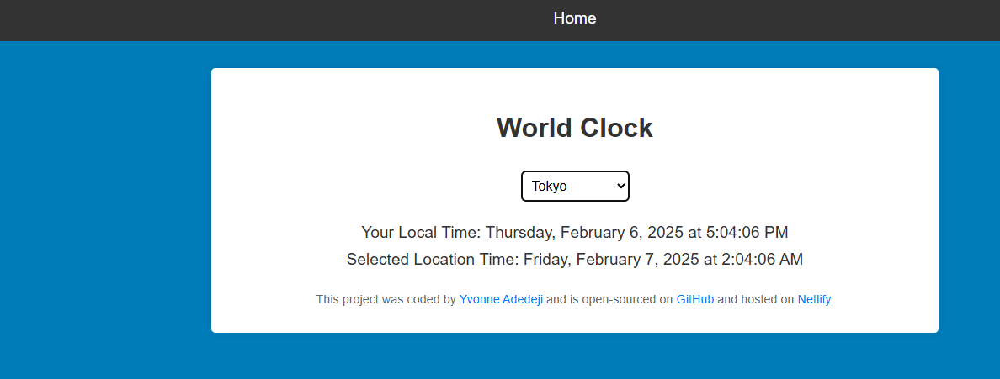
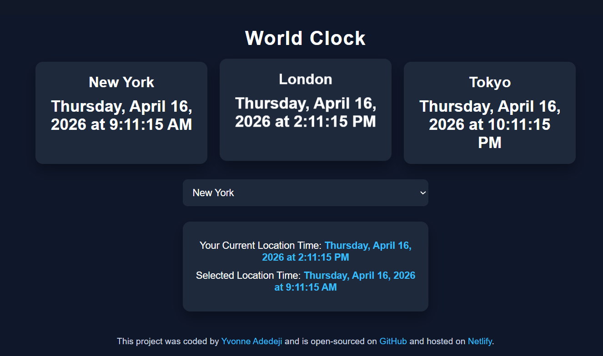
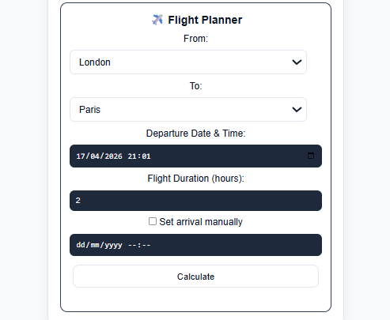
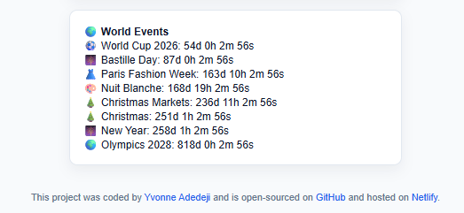
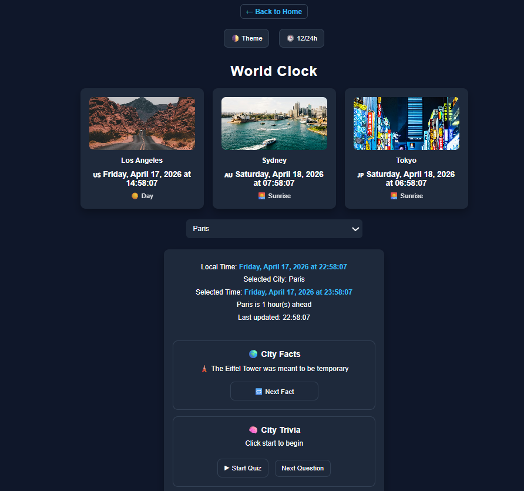

# world-clock

## 📌 Description
The World Clock is an interactive web application that displays real-time time across multiple global time zones. Beyond simple time tracking, it enhances user experience with city facts, quizzes, event countdowns, and a built-in flight planner making it useful for remote work, travel planning, and global awareness.

## 🛠 Prerequisites
* 🌐 Web Browser (Chrome, Firefox, Edge, Safari)
* 🛠 Code Editor (VS Code) 
* 🌍 Internet Connection – required to access the live hosted application

## 📋 Features
* 🕒 Displays real-time local time based on the user’s system timezone
* 🌆 Shows live time for multiple major cities (New York, London, Tokyo)
* 📍 Allows users to select additional cities from a dropdown
* 🔄 Updates time every second automatically
* 📱 Fully responsive design for mobile, tablet, and desktop
* 🔗 Dynamic “Back to Home” link appears on selection

 ## 💻 Technologies Used
The application is built with the following technologies:
* HTML
* CSS
* JavaScript

## 🚀 Installation
No installation is required to use the app. It is hosted online and can be accessed via a web browser.

## 📚 Usage
1. Open the application in your browser
2. View your local time automatically displayed
3. Select a city from the dropdown
4. Explore:
* Time comparison
* City facts
* Quiz
* Event countdowns
5. Use the Flight Planner to calculate travel times
6. Toggle theme and time format as needed

## 🔗 Live Demo & Repository
Application can be viewed here: 
* [Live](https://ya-world-clock.netlify.app/)

* [Repository](https://github.com/yvonnesarah/world-clock)

## 🖼 Screenshot
Before Design

World Clock Interface

After Design

World Clock Interface

World Clock - Flight Planner

World Clock - World Events

World Clock - Dark Theme

## 🗺️ Roadmap (Planned Features)
To expand the global awareness and interactivity of the World Clock, the following features are planned:

🌆 City Insights
* 🌍 Rotating city facts
* 🧠 Interactive city quiz/trivia system
* 🌅 Day/Night indicator (Sunrise, Day, Sunset, Night)

🌍 World Events

⏳ Live countdowns for global events:
* New Year
* Christmas
* Olympics
* World Cup
* 📍 City-specific event tracking (e.g., Wimbledon, Cherry Blossom season)

## 🚀 Upcoming Features
These upcoming features focus on improving core functionality and enhancing the overall user experience:

🕒 Core Functionality
* Shows live time for major cities (New York, London, Tokyo, Paris, Sydney, Los Angeles)
* Automatically updates every second
* Supports both 12-hour and 24-hour formats

🎨 User Experience
* 🌗 Light/Dark mode toggle
* 🔗 Dynamic “Back to Home” navigation

## 🧠 Advanced Features (Professional Level)
These advanced features aim to bring professional-grade tools and deeper functionality to the World Clock:

✈️ Flight Planner
* Calculate departure and arrival times across time zones
* Auto-estimated flight duration
* Manual arrival override option
* 🌍 Time difference calculation
* 🧳 Jet lag estimation

## 👥 Credit
Designed and developed by Yvonne Adedeji.

## 📜 License
This project is open-source. For licensing details, please refer to the LICENSE file in the repository.

## 📬 Contact
You can reach me at 📧 yvonneadedeji.sarah@gmail.com.
